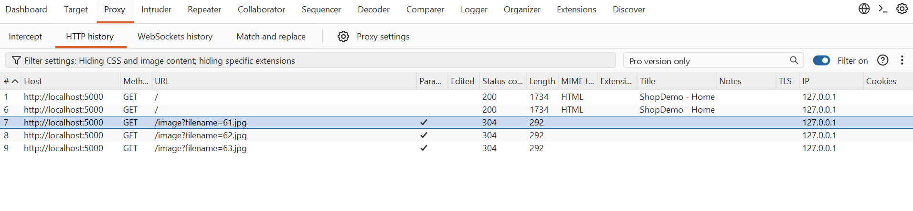
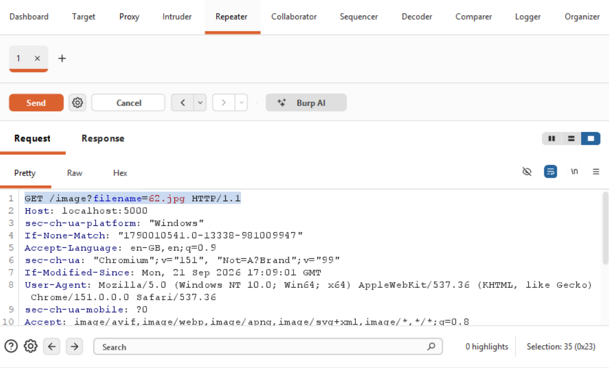
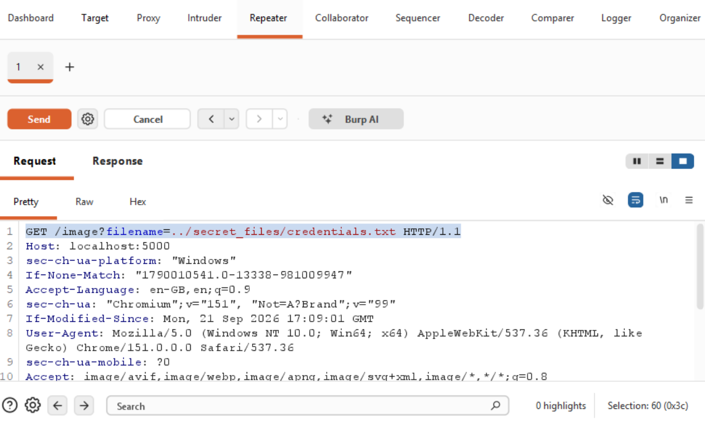
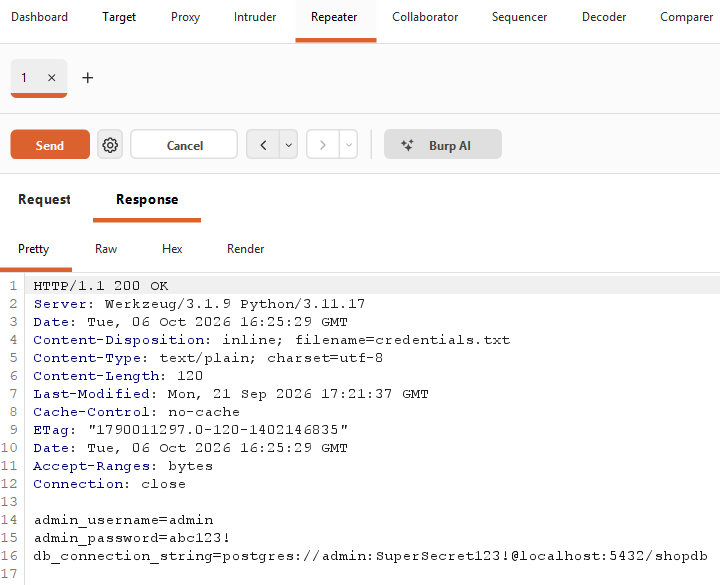
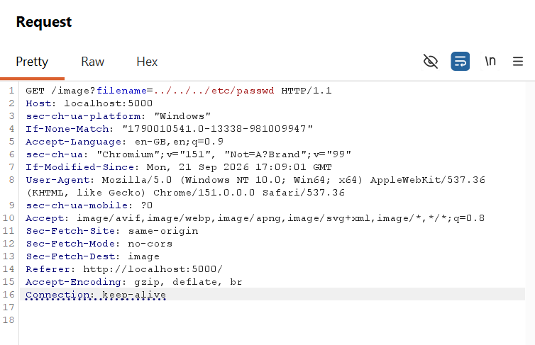
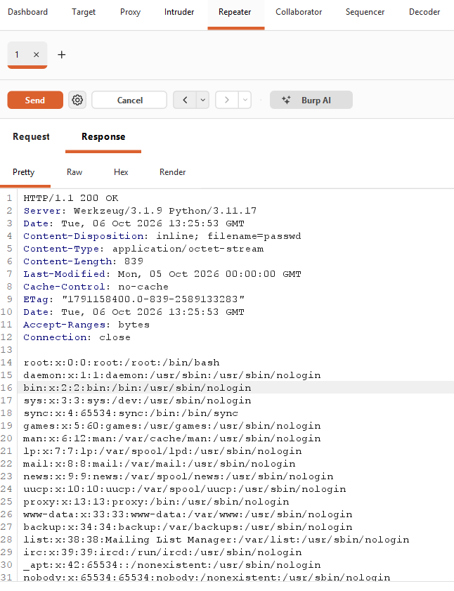

# Attack exploitation Procedure

## 1. Locate request from burp suite

## 2. Send the request to Repeater

## 3. Change the filename to access file and send the request (Malicious request)

### MALICIOUS SCRIPT 
GET /image?filename=../secret_files/credentials.txt

## 4. Get the information

## When hosted in real linux server, the attackers can access etc/passwd file by traversing to root directory using ../../ sequences

### malicious request

### Output of passwd

